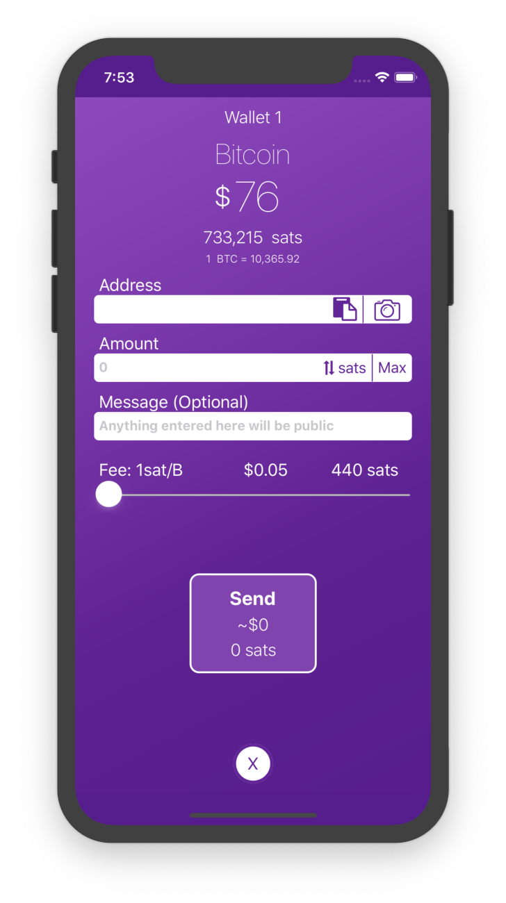
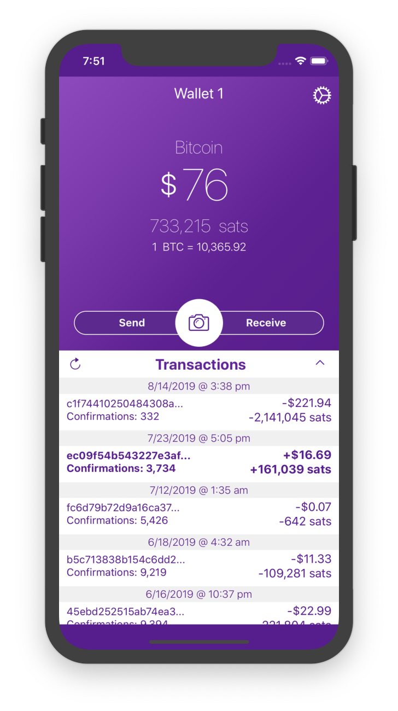
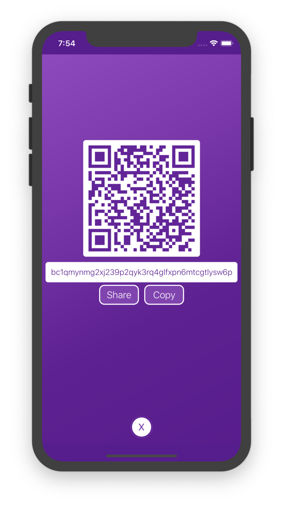

# Moonshine
Moonshine is available for testing on [iOS](https://testflight.apple.com/join/yTLqj9Xn) & [Android](https://play.google.com/store/apps/details?id=com.kisswallet)

Website: [moonshinewallet.com](https://moonshinewallet.com)

<p style="align-items: center">
  
   
  
</p>

> Moonshine is a homebrewed, open-source, non-custodial, Bitcoin/Litecoin Electrum wallet for iOS & Android.

Built with React Native, Moonshine utilizes Electrum's JSON-RPC methods to interact with the Bitcoin/Litecoin network.

Moonshine's intended use is as a hot wallet.
Meaning, your keys are only as safe as the device you install this wallet on.
As with any hot wallet, please ensure that you keep only a small, responsible amount of Bitcoin/Litecoin on it at any given time.

If you are looking for secure cold storage solutions please consider purchasing a [Trezor](https://wallet.trezor.io) or a [Ledger](https://www.ledger.com/)

### Installation
1. Clone Moonshine and Install Dependencies:
   ```
    git clone https://github.com/coreyphillips/moonshine
    cd moonshine
    yarn install
    ```
2. Start the project:
    - iOS: `react-native run-ios`
    - Android: `react-native run-android`
### Feature Roadmap
* Complete:
    * Bitcoin/Litecoin Mainnet & Testnet supported
    * Bech32 support
    * Multiple wallet support
    * Electrum
        * Support for both random and custom peers
    * Encrypted storage
    * Biometric + Pin authentication
    * Custom fee selection
    * Import mnemonic phrases via manual entry or scanning
    * RBF functionality
    * BIP39 Passphrase functionality
    * Support for Segwit-compatible & legacy addresses in settings
    * Support individual private key sweeping
    * UTXO blacklisting
        * Accessible via the Transaction Detail view, this allows users to blacklist any utxo that they do not wish to include in their list of available utxo's when sending transactions. Blacklisting a utxo excludes it's amount from the wallet's total balance.
    * Ability to Sign & Verify Messages
    * Support BitID for passwordless authentication
    * Coin Control
        * This can be accessed from the Send Transaction view and basically allows users to select from a list of available UTXO's to include in their transaction.
    * Broadcast raw transactions

For an up-to-date list of features that are in progress please refer to Moonshine's [issue page.](https://github.com/coreyphillips/moonshine/issues)
If you do not see a feature that you want feel free to create a new issue requesting it or reach out at support@moonshinewallet.com and let me know.

### Contributing

1. Fork it (<https://github.com/coreyphillips/moonshine>)
2. Create your feature branch (`git checkout -b feature/fooBar`)
3. Commit your changes (`git commit -am 'Add some fooBar'`)
4. Push to the branch (`git push origin feature/fooBar`)
5. Create a new Pull Request

### Altcoin Support
Please be aware and take note that my primary focus is on expanding the core functionality of this wallet and not on adding altcoins. However, for those wishing to add a specific altcoin for personal use, I have created the following guide so that you may fork off in a proper fashion:
[Altcoin Implementation Guide](https://gist.github.com/coreyphillips/91de5d15964797054988522664cc3150)
 
 If you have any questions regarding this guide I'm always happy to help so don't hesitate to reach out.

### Support

Supported Derivation Paths: m/0' | 44' | 49' | 84' /0'/0'

Again, if you have any questions, feature requests, etc., please feel free to create an issue on [Github](https://github.com/coreyphillips/moonshine/issues), reach out to me on [Twitter](https://twitter.com/coreylphillips) or send an email to support@moonshinewallet.com.

### Donate

I built this app to learn and have fun. I never intend to monetize or turn a profit on this app so if you found it useful, cool or interesting please consider donating:

 - **Bitcoin:** [bc1qm6knmtrk5jfyt57rwkm8j74kxskxyrl504tlc9](https://blockstream.info/address/bc1qm6knmtrk5jfyt57rwkm8j74kxskxyrl504tlc9)
 - **Bitcoin Testnet:** [tb1qxvg88t7a498yfdxgs4rjaz3r75dyr64h5r5wd7](https://blockstream.info/testnet/address/tb1qxvg88t7a498yfdxgs4rjaz3r75dyr64h5r5wd7)
 - **Litecoin:** [ltc1qrctkm565xale82pjt6nsxsyvvmln2qz8dpf6q9](https://sochain.com/address/LTC/ltc1qrctkm565xale82pjt6nsxsyvvmln2qz8dpf6q9)
 - **Litecoin Testnet:** [tltc1qxvg88t7a498yfdxgs4rjaz3r75dyr64hdtksah](https://sochain.com/address/LTCTEST/tltc1qxvg88t7a498yfdxgs4rjaz3r75dyr64hdtksah)

### Meta

Corey Phillips – [@coreylphillips](https://twitter.com/coreylphillips)

Distributed under the MIT license. See ``LICENSE`` for more information.

[https://github.com/coreyphillips/moonshine](https://github.com/coreyphillips/moonshine)

### License [MIT](https://github.com/coreyphillips/moonshine/blob/master/LICENSE)

### Acknowledgments
* Giant shoutout to the authors and contributors of the following projects along with everyone who has taken the time to provide feedback and help me through this process of learning and development. You are all awesome:
    * [bitcoinjs-lib](https://github.com/bitcoinjs/bitcoinjs-lib)
        * For providing a powerful library with detailed documentation capable of handling all of the necessary client-side, Bitcoin-related heavy-lifting.
    * [Electrum](https://electrum.org)
        * For providing a simple and flexible way to interact with the Bitcoin network.
    * [Lightning-App](https://github.com/lightninglabs/lightning-app)
        * For providing the initial inspiration for the main UI of this app and for providing a wonderful guide/example of how to implement Lightning via Neutrino.
    * Testers!
        * Thank you for the encouragement, exceptional feedback and help troubleshooting throughout the development process. You are a large part of what makes this community great. Thank you!
        * Special shoutout to the Groestlcoin team for their awesome help with QA and bug catching as they setup their own [fork.](https://github.com/Groestlcoin/moonshine/tree/grs)
